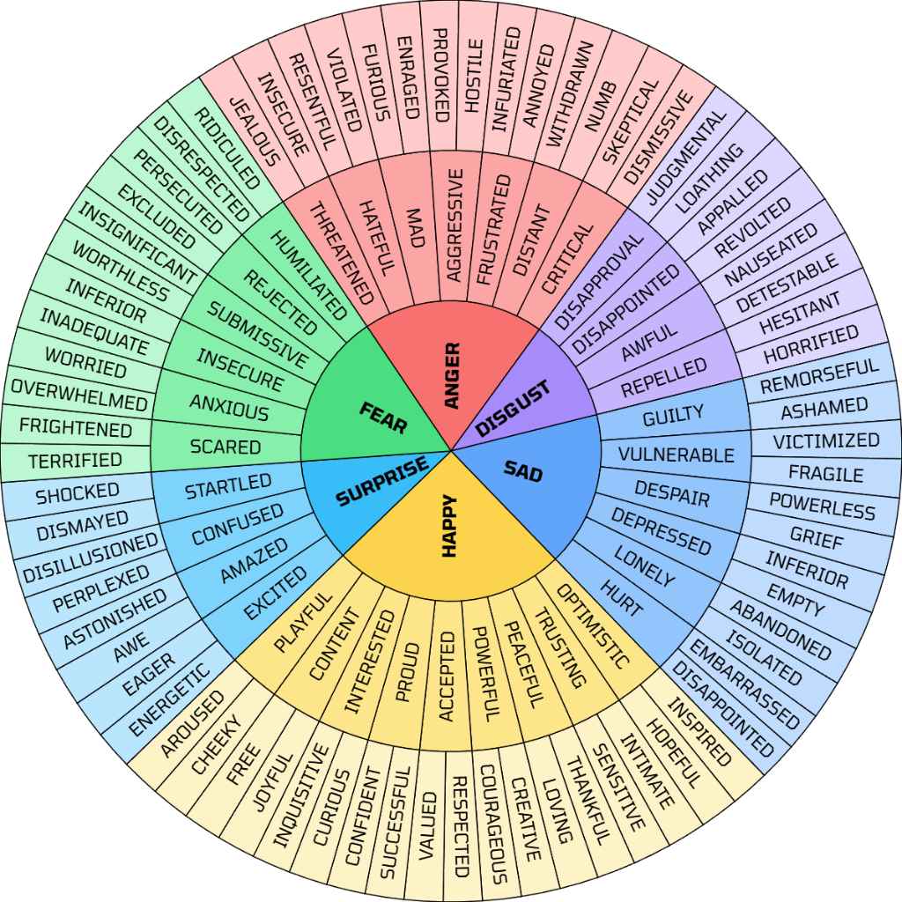

# Wheel of Emotions

An interactive and customizable Wheel of Emotions generator based on the Feeling Wheel by Dr. Gloria Willcox.



## Features

- **Interactive Segments**: Click any emotion segment to customize its text, background color, and text color.
- **Dynamic Hierarchy**: Add sub-emotions/child segments to expand tiers, or delete unwanted segments.
- **Customization Controls**:
  - **Rotation**: Rotate the wheel via range input or dragging the wheel directly.
  - **Segment Padding**: Adjust borders and spacing between segments.
  - **Typography**: Select from popular Google Fonts or load custom Google Fonts dynamically.
  - **Exporting**: Save your configured wheel as high-resolution PNG or vector SVG.
- **Undo/Redo System**: Debounced change tracking lets you step backward and forward through edits.
- **Dark Mode**: Sleek dark and light interfaces.
- **Local Storage Persistence**: Automatically saves your current custom wheel configuration so you never lose your progress.

## Tech Stack

- **Framework**: React 19 + TypeScript + Vite
- **Styling**: Tailwind CSS v4
- **Visualization**: D3.js

## Development

```bash
# Install dependencies
npm install

# Run the dev server
npm run dev

# Build the production bundle
npm run build
```
